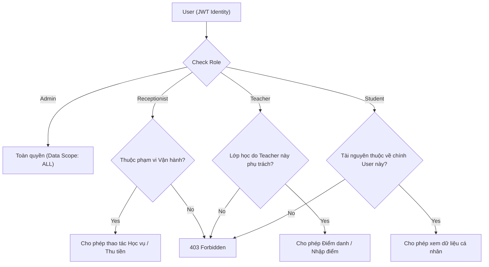

# ROLE & PERMISSION SPECIFICATION
# VLEARN ENGLISH CENTER STUDENT MANAGEMENT SYSTEM (VLEARN EC-SMS)
### Tài liệu Đặc tả Phân quyền, Vai trò & Phạm vi Dữ liệu Toàn hệ thống

---

## 1. OVERVIEW (TỔNG QUAN)

- **Đơn vị áp dụng:** VLearn English Center (Hệ thống Quản lý Học viên Trung tâm Anh ngữ VLearn).
- **Mục tiêu tài liệu:** Thiết lập tiêu chuẩn bảo mật, cấu trúc vai trò (RBAC - Role-Based Access Control) kết hợp kiểm soát phạm vi dữ liệu theo ngữ cảnh (ABAC / Data Scoping) cho toàn bộ hệ thống Web VLearn.
- **Nguyên lý cốt lõi:**
  1. **Zero-Trust Frontend:** Giao diện người dùng (Frontend) chỉ chịu trách nhiệm điều hướng và nâng cao trải nghiệm người dùng (UX). **Backend là nguồn chân lý duy nhất (Single Source of Truth)** trong việc xác thực danh tính và kiểm soát quyền truy cập.
  2. **Kiểm soát đa tầng (3-Tier Security Gates):** Mọi request đến tài nguyên bảo vệ đều phải vượt qua 3 tầng: *Xác thực danh tính (Authentication)* $\rightarrow$ *Kiểm tra vai trò (Role Check)* $\rightarrow$ *Kiểm tra phạm vi sở hữu dữ liệu (Data Scope & Ownership Check)*.
  3. **Bảo toàn lịch sử nghiệp vụ:** Ưu tiên lưu trữ (Archive / Soft Delete) thay vì xóa vĩnh viễn (Hard Delete) đối với các thực thể liên quan đến học vụ và tài chính.

---

## 2. ROLE DEFINITIONS (ĐỊNH NGHĨA 4 VAI TRÒ CHUẨN)

Hệ thống VLearn bao gồm chính xác **4 vai trò bắt buộc**, không thêm bất kỳ vai trò trung gian nào trong phiên bản MVP:

```
[VLearn System Roles]
 ├── 1. ADMIN (Quản trị viên Hệ thống)
 ├── 2. RECEPTIONIST (Lễ tân / Chuyên viên Vận hành Tuyển sinh)
 ├── 3. TEACHER (Giáo viên Giảng dạy)
 └── 4. STUDENT (Học viên)
```

### 2.1. ADMIN (Quản trị viên)
- **Định danh nghiệp vụ:** Chủ trung tâm, Giám đốc học thuật, hoặc Quản trị viên kỹ thuật cao nhất.
- **Trách nhiệm:** Toàn quyền quản lý, giám sát và cấu hình toàn bộ hoạt động của trung tâm VLearn từ nhân sự, tài chính, lớp học, tài khoản đến phân quyền.
- **Data Scope:** `ALL` (Toàn bộ dữ liệu của tất cả chi nhánh/lớp học trong hệ thống).

### 2.2. RECEPTIONIST (Lễ tân / Nhân viên Tuyển sinh & Học vụ)
- **Định danh nghiệp vụ:** Nhân sự phụ trách tiếp đón học viên, tư vấn tuyển sinh, ghi danh xếp lớp, theo dõi học phí và thu tiền.
- **Trách nhiệm:** Vận hành luồng tuyển sinh, chăm sóc hồ sơ học viên, chuyển lớp, phát hành hóa đơn học phí, ghi nhận thanh toán và theo dõi chuyên cần.
- **Giới hạn nghiêm ngặt:**
  - Không được quản lý tài khoản Admin.
  - Không được can thiệp vào cấu hình phân quyền hệ thống.
  - Không được nhập điểm hoặc sửa điểm học tập (chỉ được xem).
  - Không được điểm danh thay cho giáo viên (trừ khi có xác nhận ghi đè đặc biệt từ Admin).
- **Data Scope:** `OPERATIONAL` (Toàn bộ dữ liệu học viên, lớp học, hóa đơn và lịch sử thanh toán cần thiết cho nghiệp vụ hàng ngày).

### 2.3. TEACHER (Giáo viên)
- **Định danh nghiệp vụ:** Giáo viên bản ngữ hoặc giáo viên Việt Nam trực tiếp giảng dạy các lớp kỹ năng (Listening, Speaking, Reading, Writing) tại VLearn.
- **Trách nhiệm:** Xem lịch giảng dạy, theo dõi danh sách học viên trong lớp mình, thực hiện điểm danh từng buổi học (Class Session), nhập và đánh giá kết quả học tập (4 kỹ năng), chia sẻ tài liệu bài giảng cho lớp.
- **Giới hạn nghiêm ngặt:**
  - Tuyệt đối không được xem hoặc can thiệp vào module Học phí (Tuition Invoices) và Thu tiền (Payments).
  - Không được xem thông tin hoặc chỉnh sửa điểm danh/điểm số của các lớp mà mình **không** được phân công giảng dạy.
  - Không được tạo mới hoặc chỉnh sửa hồ sơ học viên trên phạm vi toàn hệ thống.
- **Data Scope:** `ASSIGNED_CLASSES_ONLY` (Chỉ các Lớp học, Buổi học, và Học viên thuộc lớp mà mình được phân công làm giáo viên phụ trách).

### 2.4. STUDENT (Học viên)
- **Định danh nghiệp vụ:** Học viên đang theo học các khóa học kỹ năng hoặc chương trình luyện thi tại VLearn.
- **Trách nhiệm:** Xem thông tin cá nhân, thời khóa biểu cá nhân, lịch sử chuyên cần cá nhân, bảng điểm đánh giá 4 kỹ năng của bản thân, theo dõi hóa đơn học phí và lịch sử nộp tiền của chính mình.
- **Giới hạn nghiêm ngặt:**
  - Chỉ được xem dữ liệu gắn liền với mã định danh (`User ID` / `Student ID`) của chính mình.
  - Tuyệt đối không được truy cập dữ liệu của học viên khác, giáo viên hoặc nhân sự trung tâm.
  - Không có quyền chỉnh sửa điểm số, điểm danh, hóa đơn hay lớp học.
- **Data Scope:** `SELF_ONLY` (Dữ liệu của chính bản thân mình).

---

## 3. PERMISSION MATRIX (MA TRẬN QUYỀN TỔNG QUAN)

Bảng phân quyền tổng quan cho **15 phân hệ chức năng** của VLearn:

| Phân hệ (Module) | ADMIN | RECEPTIONIST | TEACHER | STUDENT |
| :--- | :---: | :---: | :---: | :---: |
| **1. Dashboard** | Toàn quyền (Toàn trung tâm) | Vận hành & Doanh thu | Lịch dạy & Chuyên cần lớp | Lịch học, Điểm & Học phí cá nhân |
| **2. Students (Học viên)** | Full CRUD | Xem, Tạo, Sửa hồ sơ, Lọc | Chỉ xem HS lớp mình | Chỉ xem hồ sơ cá nhân |
| **3. Teachers (Giáo viên)** | Full CRUD | Chỉ xem danh sách | Chỉ xem hồ sơ cá nhân | Không có quyền |
| **4. Classes (Lớp học)** | Full CRUD | Chỉ xem danh sách & Sĩ số | Chỉ xem lớp mình phụ trách | Chỉ xem lớp mình đang học |
| **5. Enrollments (Ghi danh)**| Full CRUD | Ghi danh, Chuyển, Rút lớp | Không có quyền | Xem lịch sử ghi danh cá nhân |
| **6. Schedule (Thời khóa biểu)**| Full CRUD | Chỉ xem | Chỉ xem lịch dạy của mình | Chỉ xem thời khóa biểu cá nhân |
| **7. Class Sessions (Buổi học)**| Full CRUD | Chỉ xem | Xem buổi học lớp mình | Xem buổi học lớp mình |
| **8. Attendance (Điểm danh)**| Full CRUD + Giám sát | Chỉ xem chuyên cần | Điểm danh & Sửa lớp mình | Chỉ xem lịch sử cá nhân |
| **9. Learning Results (Điểm số)**| Full CRUD | Chỉ xem kết quả | Nhập & Sửa điểm lớp mình | Chỉ xem bảng điểm cá nhân |
| **10. Tuition Invoices (Học phí)**| Full CRUD | Xem, Tạo & Theo dõi nợ | **KHÔNG CÓ QUYỀN** | Xem hóa đơn cá nhân |
| **11. Payments (Thu tiền)** | Full CRUD | Ghi nhận thu tiền, Xem LS | **KHÔNG CÓ QUYỀN** | Xem lịch sử đóng tiền cá nhân |
| **12. Accounts (Tài khoản)** | Full CRUD | Không có quyền | Không có quyền | Tự đổi mật khẩu cá nhân |
| **13. Roles & Permissions** | Toàn quyền cấu hình | **KHÔNG CÓ QUYỀN** | **KHÔNG CÓ QUYỀN** | **KHÔNG CÓ QUYỀN** |
| **14. Notice Board (Thông báo)**| Full CRUD | Tạo & Xem thông báo | Xem thông báo | Xem thông báo |
| **15. Study Materials (Tài liệu)**| Full CRUD | Chỉ xem | Upload & Xóa cho lớp mình | Tải tài liệu lớp mình đang học |

---

## 4. ACTION-LEVEL PERMISSIONS (CHI TIẾT QUYỀN THEO HÀNH ĐỘNG)

Ký hiệu:
- ✅ **Allow:** Được phép thực hiện.
- 🟡 **Scoped:** Được phép thực hiện nhưng bị giới hạn theo điều kiện/phạm vi dữ liệu (Resource Ownership / Self).
- ❌ **Deny:** Bị nghiêm cấm hoàn toàn.

| Module | Hành động (Action) | ADMIN | RECEPTIONIST | TEACHER | STUDENT |
| :--- | :--- | :---: | :---: | :---: | :---: |
| **Dashboard** | View System Metrics | ✅ | 🟡 (No System Security) | ❌ | ❌ |
| | View Teaching Schedule | ✅ | ✅ | 🟡 (Assigned only) | ❌ |
| | View Personal Progress | ✅ | ❌ | ❌ | 🟡 (Self only) |
| **Students** | View List | ✅ | ✅ | ❌ | ❌ |
| | View Detail (360 Profile) | ✅ | ✅ | 🟡 (If in teacher class) | 🟡 (Self only) |
| | Create Student | ✅ | ✅ | ❌ | ❌ |
| | Update Student Profile | ✅ | ✅ | ❌ | 🟡 (Phone/Address only) |
| | Archive / Deactivate Student | ✅ | 🟡 (Theo quy chế trung tâm) | ❌ | ❌ |
| | Delete Student (Hard) | ✅ (No history only) | ❌ | ❌ | ❌ |
| **Teachers** | View List | ✅ | ✅ | ❌ | ❌ |
| | View Detail | ✅ | ✅ | 🟡 (Self only) | ❌ |
| | Create Teacher | ✅ | ❌ | ❌ | ❌ |
| | Update Teacher | ✅ | ❌ | 🟡 (Self contact info) | ❌ |
| | Archive / Deactivate Teacher | ✅ | ❌ | ❌ | ❌ |
| **Classes** | View List | ✅ | ✅ | 🟡 (Assigned only) | 🟡 (Enrolled only) |
| | View Detail | ✅ | ✅ | 🟡 (Assigned only) | 🟡 (Enrolled only) |
| | Create Class | ✅ | ❌ | ❌ | ❌ |
| | Update Class | ✅ | ❌ | ❌ | ❌ |
| | Assign Teacher to Class | ✅ | ❌ | ❌ | ❌ |
| | Archive / Close Class | ✅ | ❌ | ❌ | ❌ |
| **Enrollments** | Enroll Student to Class | ✅ | ✅ | ❌ | ❌ |
| | Transfer Student Class | ✅ | ✅ | ❌ | ❌ |
| | Drop / Cancel Enrollment | ✅ | ✅ | ❌ | ❌ |
| **Schedule / Sessions** | Create / Update Schedule | ✅ | ❌ | ❌ | ❌ |
| | View Timetable | ✅ | ✅ | 🟡 (Assigned only) | 🟡 (Enrolled only) |
| | Generate Class Sessions | ✅ | ❌ | ❌ | ❌ |
| **Attendance** | Mark Attendance | ✅ | ❌ | 🟡 (Assigned class only) | ❌ |
| | Edit Attendance | ✅ | ❌ | 🟡 (Within edit window) | ❌ |
| | View Attendance Summary | ✅ | ✅ | 🟡 (Assigned class only) | 🟡 (Self history only) |
| **Learning Results** | Enter Results (4 skills) | ✅ | ❌ | 🟡 (Assigned class only) | ❌ |
| | Edit Results | ✅ | ❌ | 🟡 (Assigned class only) | ❌ |
| | View Learning Results | ✅ | ✅ | 🟡 (Assigned class only) | 🟡 (Self results only) |
| **Tuition Invoices** | View Invoice List | ✅ | ✅ | ❌ | ❌ |
| | View Invoice Detail | ✅ | ✅ | ❌ | 🟡 (Self invoices only) |
| | Create Invoice | ✅ | ✅ (On enrollment) | ❌ | ❌ |
| | Update Invoice | ✅ | 🟡 (Ghi chú/Hạn nộp) | ❌ | ❌ |
| **Payments** | Record Payment (Thu tiền) | ✅ | ✅ | ❌ | ❌ |
| | View Payment History | ✅ | ✅ | ❌ | 🟡 (Self payments only) |
| | Hard Delete Payment | ❌ (Forbidden) | ❌ (Forbidden) | ❌ (Forbidden) | ❌ (Forbidden) |
| **Accounts & Roles** | Create Internal Account | ✅ | ❌ | ❌ | ❌ |
| | Change Account Status | ✅ | ❌ | ❌ | ❌ |
| | Assign / Change Role | ✅ | ❌ | ❌ | ❌ |
| | Change Own Password | ✅ | ✅ | ✅ | ✅ |

---

## 5. DATA SCOPE RULES (QUY TẮC PHẠM VI DỮ LIỆU)

Để ngăn chặn lỗ hổng rò rỉ dữ liệu qua việc đoán ID (Insecure Direct Object Reference - IDOR), hệ thống VLearn quy định chặt chẽ phạm vi truy vấn cho từng vai trò:

### 5.1. Admin Scope (`scope = ALL`)
- Cho phép truy vấn tất cả các bản ghi không bị giới hạn bởi `teacherId`, `studentId` hay `classId`.
- Có thể lọc theo bất kỳ tiêu chí nào trong toàn hệ sinh thái VLearn.

### 5.2. Receptionist Scope (`scope = OPERATIONAL`)
- **Được truy cập:**
  - Toàn bộ danh sách học viên trung tâm (`User` có `role = 'Student'`).
  - Toàn bộ các lớp học (`Class`) để tư vấn sĩ số, phòng học, lịch học cho học viên.
  - Toàn bộ hóa đơn học phí (`TuitionInvoice`) và phiếu thu tiền (`Payment`) để phục vụ thu hồi công nợ.
- **Bị giới hạn:**
  - Không thể đọc danh sách tài khoản Admin, mật khẩu băm, hay log bảo mật hệ thống.
  - Khi xem điểm học tập (`LearningResult`), chỉ có quyền đọc (`read-only`), không được phép gửi payload thay đổi điểm số.

### 5.3. Teacher Scope (`scope = ASSIGNED_CLASSES_ONLY`)
- **Quy tắc phụ thuộc (Class Ownership Filter):**
  $$\text{Accessible Classes} = \{ c \in \text{Classes} \mid c.\text{teacherId} == \text{req.user.\_id} \}$$
- **Quy tắc truy cập học viên:**
  Teacher **chỉ có thể** xem thông tin của Student $S$ nếu:
  $$\exists c \in \text{Accessible Classes} \text{ mà } S \text{ có bản ghi Enrollment đang hoạt động trong } c$$
- Nếu một Teacher cố tình gọi API truyền `classId` của lớp khác hoặc `studentId` không học lớp của mình, Backend phải trả về `403 Forbidden` hoặc `404 Not Found`.

### 5.4. Student Scope (`scope = SELF_ONLY`)
- **Quy tắc tuyệt đối (Self Identity Binding):**
  - Mọi thao tác truy vấn lịch học, điểm số, chuyên cần và học phí của Student **bắt buộc phải lấy từ `req.user._id` trích xuất từ JWT**.
  - Backend **không bao giờ chấp nhận** tham số `studentId` được truyền tự do từ URL query hoặc request body của Student.
  - Ví dụ: Endpoint lấy điểm danh của học viên luôn là:
    `GET /api/student/attendance` $\rightarrow$ Query ngầm định trong Controller: `{ student: req.user._id }`.
  - Nếu học viên cố gắng gọi `GET /api/students/HV2026999/results`, Backend kiểm tra nếu `HV2026999` $\ne$ `req.user._id` sẽ lập tức chặn lại với mã lỗi `403 Forbidden`.

---

## 6. RESOURCE OWNERSHIP RULES (QUY TẮC SỞ HỮU TÀI NGUYÊN)



### Các ràng buộc sở hữu thực thể cụ thể:
1. **Attendance Record:**
   - Thuộc về một `ClassSession` cụ thể.
   - Chỉ được ghi nhận / chỉnh sửa bởi Teacher được phân công cho Lớp học đó (hoặc Admin).
2. **Learning Result Record:**
   - Thuộc về một `Student` trong một `Class` cụ thể.
   - Chỉ được tạo / sửa bởi Teacher phụ trách Lớp đó (hoặc Admin).
3. **Tuition Invoice & Payment Record:**
   - `TuitionInvoice` thuộc về một `Student` và được phát hành khi `Enrollment` được tạo.
   - `Payment` được gắn với một `TuitionInvoice` và lưu vết rõ ràng `createdBy` (Admin hoặc Receptionist thu tiền).
   - Teacher không có quyền liên kết tới bất kỳ tài nguyên tài chính nào.

---

## 7. BACKEND AUTHORIZATION RULES (QUY TẮC KIỂM SOÁT PHÍA SERVER)

Backend là rào chắn bảo vệ cuối cùng và quan trọng nhất. Mỗi API endpoint tại VLearn bắt buộc phải áp dụng quy trình kiểm tra 3 bước tuần tự:

```
[Incoming Request]
       │
       ▼
[Gate 1: Authentication] ──(Token thiếu / Sai / Hết hạn / User Inactive)──> [401 Unauthorized]
       │
      Valid
       ▼
[Gate 2: Role Authorization] ──(Role không nằm trong allowedRoles)───────> [403 Forbidden]
       │
     Passed
       ▼
[Gate 3: Data Scope & Ownership] ──(Truy cập tài nguyên ngoài quyền sở hữu)─> [403 Forbidden hoặc 404]
       │
     Passed
       ▼
[Execute Controller Business Logic]
```

### Quy ước phản hồi HTTP Status Code:
- **`401 Unauthorized`:**
  - Client không gửi kèm header `Authorization: Bearer <token>`.
  - Token bị sai chữ ký (Invalid Signature), bị can thiệp, hoặc đã hết hạn (Expired).
  - Tài khoản liên kết với Token đã bị khóa (`status == 'inactive'`).
- **`403 Forbidden`:**
  - Client đã đăng nhập hợp lệ nhưng Role không có quyền truy cập endpoint (Ví dụ: Teacher cố tình gọi API `/api/tuition`).
  - Client có Role phù hợp nhưng vi phạm quy tắc sở hữu tài nguyên (Ví dụ: Teacher A cố sửa điểm danh lớp của Teacher B; Student A truyền ID để xem bảng điểm Student B).
- **`404 Not Found` (Security Convention):**
  - Được áp dụng khi tài nguyên không tồn tại trong hệ thống.
  - *Quy ước bảo mật VLearn:* Khi Teacher hoặc Student cố tình truy cập vào một ID bản ghi không thuộc phạm vi sở hữu của mình, hệ thống có thể trả về `404 Not Found` thay vì `403 Forbidden` đối với các API dạng `GET /resource/:id` để **ngăn chặn kẻ xấu dò quét và xác nhận sự tồn tại của ID tài nguyên (Resource Enumeration Prevention)**.

---

## 8. FRONTEND VISIBILITY RULES (QUY TẮC HIỂN THỊ GIAO DIỆN)

Frontend phản ánh cấu trúc phân quyền thông qua trải nghiệm giao diện người dùng (UI/UX) sạch sẽ và mạch lạc:

### 8.1. Điều hướng và Khóa Route (`ProtectedRoute`)
- Người dùng chưa đăng nhập khi truy cập bất kỳ route nội bộ nào sẽ bị chuyển hướng ngay về `/login`.
- Người dùng khi truy cập vào route ngoài danh sách `allowedRoles` sẽ bị chuyển hướng về Dashboard mặc định của họ:
  - Admin $\rightarrow$ `/admin/dashboard`
  - Receptionist $\rightarrow$ `/receptionist/dashboard`
  - Teacher $\rightarrow$ `/teacher/dashboard`
  - Student $\rightarrow$ `/student/dashboard`

### 8.2. Ẩn/Hiện Menu điều hướng (Sidebar / Navbar)
- Sidebar của mỗi Role chỉ render các mục menu thuộc thẩm quyền của Role đó.
- Menu của Teacher **không bao giờ hiển thị** các mục "Học phí", "Thu tiền", "Quản trị tài khoản".
- Menu của Receptionist **không bao giờ hiển thị** mục "Phân quyền", "Tài khoản Quản trị", "Nhập điểm kỹ năng".
- Menu của Student được thiết kế riêng dạng thanh điều hướng tinh gọn (Top Navbar / Clean Student Portal) chỉ hiển thị: Lịch học, Điểm danh, Kết quả học tập, Học phí cá nhân, Thông báo, Tài liệu.

### 8.3. Ẩn/Khóa nút bấm hành động (Action Buttons & Controls)
- Các nút hành động nhạy cảm như *Xóa lớp*, *Hủy ghi danh*, *Đổi mật khẩu tài khoản khác* chỉ hiển thị với Admin.
- Nút *Thu học phí / Ghi nhận thanh toán* chỉ hiển thị ở giao diện Admin và Receptionist.
- Nút *Điểm danh* và *Nhập điểm 4 kỹ năng* chỉ hiển thị với Teacher (ở lớp mình dạy) và Admin.

---

## 9. ACCOUNT STATUS RULES (QUY TẮC TRẠNG THÁI TÀI KHOẢN)

Mọi tài khoản người dùng (`User`) trong hệ thống VLearn đều có trường trạng thái bắt buộc:
`status: 'active' | 'inactive'` (Mặc định khi tạo mới là `active`).

### Quy tắc vận hành:
1. **Kiểm tra trạng thái khi Đăng nhập:**
   - Khi người dùng gửi form Login, nếu tài khoản có `status === 'inactive'`, hệ thống lập tức từ chối đăng nhập với thông báo: *"Tài khoản của bạn đã bị khóa hoặc tạm ngưng hoạt động. Vui lòng liên hệ Quản trị viên."*
2. **Kiểm tra trạng thái tại Middleware (`protect`):**
   - Khi nhận bất kỳ request nào có JWT Token hợp lệ, middleware `protect` giải mã `userId`, truy vấn nhanh vào cơ sở dữ liệu để kiểm tra trạng thái hiện tại của tài khoản.
   - Nếu tài khoản đã bị Admin chuyển sang `inactive` sau khi cấp token, middleware lập tức chặn request với mã `401 Unauthorized`, vô hiệu hóa quyền truy cập ngay lập tức mà không cần đợi JWT hết hạn.
3. **Thẩm quyền khóa/mở tài khoản:**
   - **Chỉ có ADMIN** mới có quyền thay đổi trạng thái của tài khoản nhân sự (Teacher, Receptionist) và tài khoản Admin khác.
   - Receptionist chỉ có quyền cập nhật trạng thái học tập của Học viên (Đang học / Tạm ngừng / Bảo lưu), không có quyền can thiệp vào tài khoản đăng nhập hệ thống của nhân sự.

---

## 10. HARD DELETE VS ARCHIVE / SOFT DELETE RULES

Để đảm bảo tính toàn vẹn của dữ liệu học vụ và ngăn ngừa gian lận tài chính, VLearn áp dụng quy tắc xóa dữ liệu nghiêm ngặt:

| Thực thể (Entity) | Có cho phép Hard Delete không? | Phương thức thay thế bắt buộc (Archive / Soft Delete) | Lý do nghiệp vụ |
| :--- | :---: | :--- | :--- |
| **Payment (Bản ghi thu tiền)** | ❌ **TUYỆT ĐỐI CẤM** | Không xóa. Nếu thu sai, tạo bản ghi điều chỉnh âm hoặc ghi chú giao dịch hủy. | Ràng buộc kế toán và kiểm toán dòng tiền trung tâm. |
| **Tuition Invoice (Hóa đơn học phí)**| ❌ **TUYỆT ĐỐI CẤM** (Nếu đã có Payment) | Chuyển trạng thái sang `Cancelled` hoặc `Archived`. | Giữ lịch sử công nợ và đối soát doanh thu. |
| **Attendance (Bản ghi điểm danh)**| ❌ **KHÔNG** | Giữ nguyên bản ghi, chỉ cập nhật trạng thái nếu giáo viên sửa nhầm. | Minh chứng số buổi đi học của học viên. |
| **Learning Result (Bảng điểm 4 kỹ năng)**| ❌ **KHÔNG** | Cập nhật điểm và lưu lịch sử chỉnh sửa nếu có phúc khảo. | Lưu hồ sơ tiến độ học tập và cấp chứng chỉ cuối khóa. |
| **Enrollment (Ghi danh)**| ❌ **KHÔNG** | Chuyển trạng thái sang `Dropped` (Thôi học) hoặc `Transferred` (Đã chuyển lớp). | Bảo toàn sĩ số lịch sử của lớp học. |
| **Class (Lớp học)** | ⚠️ Chỉ khi chưa có Enrollment | Chuyển trạng thái sang `Completed` hoặc `Archived`. | Nếu xóa lớp, toàn bộ lịch học, điểm số, điểm danh liên đới sẽ bị mồ côi. |
| **Student / Teacher Profile** | ⚠️ Chỉ khi vừa tạo nhầm và chưa phát sinh nghiệp vụ | Chuyển `status` sang `inactive` (Lưu trữ hồ sơ cũ). | Giữ thông tin học viên cũ cho việc tái ghi danh hoặc liên lạc sau này. |
| **Notice (Thông báo)** | ✅ **CHO PHÉP** | Có thể xóa hoàn toàn nếu thông báo hết hạn hoặc sai nội dung. | Dữ liệu bảng tin không ảnh hưởng đến toàn vẹn tài chính/học vụ. |
| **Study Material (Tài liệu)** | ✅ **CHO PHÉP** | Cho phép xóa file đính kèm và bản ghi liên quan. | Quản lý dung lượng lưu trữ trên máy chủ. |

---

## 11. FORBIDDEN SCENARIOS (CÁC KỊCH BẢN BỊ NGHIÊM CẤM & PHẢN HỒI)

Hệ thống phải vượt qua bài kiểm tra bảo mật trong tất cả **10 kịch bản vi phạm** dưới đây:

| STT | Kịch bản vi phạm (Attack / Unauthorized Attempt) | Hành vi của kẻ xấu / Người dùng | Phản hồi bắt buộc của Backend |
| :---: | :--- | :--- | :--- |
| **1** | **Receptionist cố truy cập phân quyền** | Gửi request `POST /api/admin/roles` hoặc sửa tài khoản Admin. | `403 Forbidden` (`adminOnly` chặn lại). |
| **2** | **Teacher cố truy cập module tài chính** | Gửi request `GET /api/tuition` hoặc `GET /api/payments`. | `403 Forbidden` (Chặn ngay tại Route Middleware). |
| **3** | **Teacher điểm danh chéo lớp của đồng nghiệp** | Teacher A gửi request `POST /api/attendance` với `classId` của Teacher B. | `403 Forbidden` (Ownership check phát hiện Teacher A không phụ trách lớp này). |
| **4** | **Teacher sửa điểm lớp không phụ trách** | Teacher A gửi request `PUT /api/results/:id` của học viên lớp khác. | `403 Forbidden` (Ownership check chặn lại). |
| **5** | **Student xem bảng điểm học viên khác** | Student A gọi `GET /api/results?studentId=ID_B` hoặc `GET /api/student/results/:idB`. | `403 Forbidden` hoặc `404 Not Found` (Hệ thống chỉ query theo `req.user._id`). |
| **6** | **Student cố tình can thiệp số dư học phí** | Student gửi request `POST /api/payments` hoặc `PUT /api/tuition/:id`. | `403 Forbidden` (Role `Student` không có quyền trên endpoint này). |
| **7** | **Tài khoản bị khóa cố gọi API** | User bị Admin chuyển sang `inactive`, dùng Token cũ để gửi request. | `401 Unauthorized` (Middleware `protect` kiểm tra DB thấy `inactive` lập tức thu hồi phiên). |
| **8** | **Receptionist cố sửa điểm học viên** | Receptionist gửi payload cập nhật điểm số tới API kết quả học tập. | `403 Forbidden` (Chỉ cho phép `Teacher` phụ trách hoặc `Admin`). |
| **9** | **Xóa cứng bản ghi thu tiền (Payment Hard Delete)**| Admin hoặc Lễ tân cố tình gửi lệnh `DELETE /api/payments/:id`. | `405 Method Not Allowed` hoặc `403 Forbidden` (Không cung cấp route DELETE cho Payment). |
| **10**| **Vượt mặt kiểm tra giao diện (Bypass UI)** | Học viên tự gõ URL `/admin/dashboard` hoặc `/teacher/attendance` vào trình duyệt. | Frontend chuyển hướng ngay về `/student/dashboard`; nếu gọi API trực tiếp qua Postman thì Backend trả về `403`. |

---

## 12. EDGE CASES (CÁC TRƯỜNG HỢP BIÊN ĐẶC THÙ)

1. **Học viên chuyển lớp giữa chừng (Mid-term Class Transfer):**
   - Khi học viên chuyển từ Lớp A sang Lớp B:
     - Lịch sử điểm danh và điểm số cũ tại Lớp A **vẫn được giữ nguyên** gắn với Lớp A để đối soát.
     - Tại Lớp B, học viên bắt đầu được điểm danh từ các Buổi học (Sessions) diễn ra sau ngày chuyển lớp.
     - Teacher lớp A sẽ không còn thấy học viên này trong danh sách điểm danh của các buổi học tương lai.
2. **Học viên học cùng lúc nhiều lớp kỹ năng khác nhau:**
   - Ví dụ: Học viên Nguyễn Văn An vừa học lớp *IELTS Speaking K12* (Teacher X dạy), vừa học lớp *IELTS Writing K15* (Teacher Y dạy).
   - Teacher X chỉ thấy thông tin điểm số và điểm danh của An trong môn Speaking. Teacher X không được xem kết quả môn Writing của An do Teacher Y phụ trách.
3. **Giáo viên dạy thay (Substitute Teacher) - Quy chế MVP:**
   - Trong phiên bản MVP, nếu Teacher X nghỉ ốm và Teacher Y dạy thay, Admin chỉ cần vào phần Quản lý Lớp học để tạm thời gán thêm Teacher Y vào lớp, hoặc Admin trực tiếp thực hiện điểm danh buổi học đó giúp giáo viên.
4. **Học viên rút học nhưng đã đóng 1 phần học phí:**
   - Khi trạng thái Enrollment chuyển sang `Dropped`, Hóa đơn học phí được cập nhật trạng thái `Archived / Dropped`, ghi chú rõ số tiền đã nộp không hoàn lại hoặc bảo lưu. Bản ghi Payment cũ tuyệt đối giữ nguyên.

---

## 13. EXISTING SOURCE MIGRATION IMPACT (PHÂN TÍCH TÁC ĐỘNG DI TRÚ MÃ NGUỒN HIỆN TẠI)

> **Lưu ý:** Mục này phân tích kiến trúc để phục vụ các bước triển khai sau. **Tuyệt đối không chỉnh sửa mã nguồn ở giai đoạn này.**

### 13.1. Chuyển đổi Khái niệm & Role
- **Hiện tại:** `role: ['Admin', 'Professor', 'Student']`.
- **Mục tiêu VLearn:** `role: ['Admin', 'Receptionist', 'Teacher', 'Student']`.
- **Các vùng mã Backend bị tác động:**
  - [models/User.js](file:///d:/BE/University-Management-System/backend/models/User.js): Cập nhật Enum `role`. Bỏ các trường đại học thừa (`category`, `isHandicapped`, `assignedCourses`), thay bằng cấu trúc giáo viên và học viên trung tâm.
  - [middleware/authMiddleware.js](file:///d:/BE/University-Management-System/backend/middleware/authMiddleware.js):
    - Đổi `professorOnly` $\rightarrow$ `teacherOnly`.
    - Thêm `receptionistOnly`, `adminOrReceptionist` (Staff Gate).
    - Bổ sung logic kiểm tra `user.status === 'active'`.
  - [routes/professorRoutes.js](file:///d:/BE/University-Management-System/backend/routes/professorRoutes.js) $\rightarrow$ Cần cấu trúc lại thành `routes/teacherRoutes.js`.
  - Cần tạo mới `routes/receptionistRoutes.js`.

### 13.2. Cấu trúc Điều hướng Frontend (Frontend Routes & Layouts)
- **Hiện tại:**
  - `/admin/*` $\rightarrow$ `AdminLayout` (Chỉ cho `Admin`)
  - `/professor/*` $\rightarrow$ `ProfessorLayout` (Chỉ cho `Professor`)
  - `/student/*` $\rightarrow$ `StudentLayout` (Chỉ cho `Student`)
- **Mục tiêu VLearn:**
  - `/admin/*` $\rightarrow$ `AdminLayout` (Chỉ cho `Admin`)
  - `/receptionist/*` $\rightarrow$ `ReceptionistLayout` (Mới - Cho `Receptionist` và `Admin`)
  - `/teacher/*` $\rightarrow$ `TeacherLayout` (Đổi tên từ `ProfessorLayout`, chỉ cho `Teacher`)
  - `/student/*` $\rightarrow$ `StudentLayout` (Chỉ cho `Student`)
- [App.jsx](file:///d:/BE/University-Management-System/frontend/src/App.jsx): Cập nhật hàm `getDashboardHome()` và các route `ProtectedRoute` với `allowedRoles` mới.

---

## 14. ACCEPTANCE CRITERIA (TIÊU CHÍ NGHIỆM THU ĐẶC TẢ PHÂN QUYỀN)

Hệ sinh thái phân quyền của VLearn được coi là đạt chuẩn khi và chỉ khi thỏa mãn đầy đủ các bài kiểm tra thực nghiệm sau:

- [ ] **Test Case 1 (Receptionist Boundary):** Đăng nhập tài khoản Receptionist $\rightarrow$ Không có menu Quản lý Phân quyền; nếu cố tình gửi request `POST /api/admin/users` với role `Admin` thì Backend trả về `403 Forbidden`.
- [ ] **Test Case 2 (Teacher Financial Isolation):** Đăng nhập tài khoản Teacher $\rightarrow$ Không có menu Học phí; nếu dùng Postman gọi `GET /api/tuition` hoặc `GET /api/payments` kèm token Teacher thì Backend trả về `403 Forbidden`.
- [ ] **Test Case 3 (Teacher Cross-Class Isolation):** Đăng nhập Teacher A $\rightarrow$ Điểm danh hoặc nhập điểm cho lớp của Teacher B $\rightarrow$ Backend trả về `403 Forbidden` / `404 Not Found`.
- [ ] **Test Case 4 (Student Identity Isolation):** Đăng nhập Student A $\rightarrow$ Xem lịch học, bảng điểm và học phí $\rightarrow$ Chỉ hiển thị đúng dữ liệu của Student A; nếu Student A truyền ID của Student B lên URL thì Backend trả về `403` hoặc dữ liệu rỗng.
- [ ] **Test Case 5 (Payment Immutability):** Đăng nhập Admin hoặc Receptionist $\rightarrow$ Ghi nhận thanh toán thành công $\rightarrow$ Số dư hóa đơn giảm chính xác $\rightarrow$ Không có bất kỳ nút bấm hoặc API nào cho phép xóa vĩnh viễn (Hard Delete) bản ghi thanh toán này.
- [ ] **Test Case 6 (Account Lockout Enforcement):** Admin khóa tài khoản (chuyển sang `inactive`) của một nhân sự $\rightarrow$ Nhân sự đó lập tức bị chặn ở request tiếp theo với mã `401 Unauthorized` và không thể đăng nhập lại.
- [ ] **Test Case 7 (Zero-Trust Validation):** Thử nghiệm sửa đổi Role lưu tại `localStorage` của trình duyệt từ `Student` thành `Admin` $\rightarrow$ Giao diện có thể đổi menu nhưng mọi request gửi về Backend đều bị `403 Forbidden` do Backend xác thực dựa trên Token JWT đã được ký mật mã bí mật.

---

> 🛑 **KẾT THÚC TÀI LIỆU ROLE & PERMISSION SPECIFICATION.**  
> Dự án tạm dừng tại đây. Không có bất kỳ tệp mã nguồn nào bị thay đổi. Chờ phê duyệt của bạn trước khi thực hiện bước tiếp theo!
