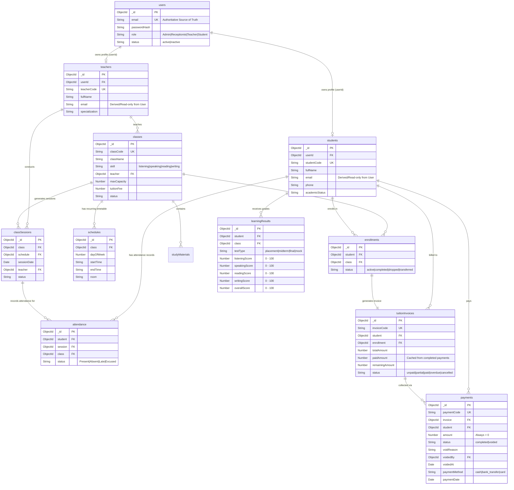

# DATA MODEL SPECIFICATION
# VLEARN ENGLISH CENTER STUDENT MANAGEMENT SYSTEM (VLEARN EC-SMS)
### Tài liệu Đặc tả Thiết kế Cơ sở Dữ liệu & Mongoose Schemas Chuẩn hóa (Phiên bản Hiệu chỉnh)

---

## 1. OVERVIEW (TỔNG QUAN)

- **Đơn vị áp dụng:** VLearn English Center (Hệ thống Quản lý Học viên Trung tâm Anh ngữ VLearn).
- **Mục tiêu tài liệu:** Thiết kế cấu trúc cơ sở dữ liệu NoSQL toàn diện cho hệ thống VLearn sử dụng **MongoDB + Mongoose**. Chuyển đổi triệt để từ cấu trúc trường đại học cũ (University/Faculty/Degrees) sang cấu trúc trung tâm Anh ngữ linh hoạt (Classes/Skills/Enrollments/Sessions/Invoices/Payments).
- **Nguyên tắc kỹ thuật:**
  - Không sửa đổi mã nguồn trong bước này.
  - Chuẩn hóa tên trường, kiểu dữ liệu, các ràng buộc toàn vẹn (Constraints & Validations) và chỉ mục (Indexes) để chuẩn bị cho giai đoạn xây dựng Mongoose Schema tiếp theo.
  - Tách bạch rõ ràng giữa dữ liệu xác thực (Auth) và thực thể nghiệp vụ (Domain Profiles).

---

## 2. MODELING PRINCIPLES (NGUYÊN TẮC THIẾT KẾ DỮ LIỆU)

1. **Chuẩn hóa quan hệ Nhiều - Nhiều (Many-to-Many Decoupling):**
   - Loại bỏ trường `enrolledCourse` độc tôn kiểu đại học. Học viên có thể học nhiều lớp cùng lúc hoặc nối tiếp thông qua collection trung gian `enrollments`.
2. **Điểm danh gắn liền Buổi học thực tế (Session-based Attendance):**
   - Không điểm danh chung theo ngày. Điểm danh là quan hệ giữa `Student` và `ClassSession`.
3. **Toàn vẹn số liệu tài chính bất biến (Append-Only Financial Ledger):**
   - Hóa đơn (`tuitionInvoices`) lưu tổng công nợ. Mỗi lần thu tiền là một bản ghi `payments` mới độc lập. Không cho phép ghi đè (overwrite) hoặc xóa cứng (hard delete) lịch sử giao dịch.
   - Các khoản thanh toán sai sót được xử lý bằng cơ chế Hủy giao dịch (`voided`) có thẩm quyền của Admin, giữ nguyên lịch sử đối soát và loại trừ khỏi tính toán doanh thu.
4. **Tránh mảng phình to không giới hạn (Unbounded Array Prevention):**
   - Không nhúng mảng `attendance`, `payments`, hay `enrollments` vào document cha. Mọi quan hệ 1-N có xu hướng tăng vô hạn đều được thiết kế dưới dạng collection riêng biệt với **ObjectId Reference**.
5. **Đảm bảo tính nhất quán (Consistency & Validation):**
   - Sử dụng Compound Unique Indexes và Partial Unique Indexes để cưỡng chế tính toàn vẹn ở tầng database engine.
   - Các nghiệp vụ phức hợp (như xung đột lịch học, ghi nhận thanh toán) được xử lý đồng bộ giữa Service-level validation và MongoDB Multi-document Transactions.

---

## 3. COLLECTION LIST (DANH SÁCH CÁC COLLECTION MỤC TIÊU)

Hệ thống VLearn quy định **13 Collections** bao gồm 11 Core Collections và 2 Utility Collections:

```
[VLearn Database Architecture]
 ├── Core Collections (11)
 │    ├── 1. users              (Tài khoản & Xác thực hệ thống)
 │    ├── 2. students           (Hồ sơ chi tiết Học viên)
 │    ├── 3. teachers           (Hồ sơ chi tiết Giáo viên)
 │    ├── 4. classes            (Lớp học theo Kỹ năng)
 │    ├── 5. enrollments        (Ghi danh, Xếp lớp & Chuyển lớp)
 │    ├── 6. schedules          (Lịch học tuần / Thời khóa biểu lặp)
 │    ├── 7. classSessions      (Từng buổi học cụ thể)
 │    ├── 8. attendance         (Bản ghi điểm danh từng buổi)
 │    ├── 9. learningResults    (Bảng điểm 4 Kỹ năng theo đợt test)
 │    ├── 10. tuitionInvoices   (Hóa đơn học phí & Công nợ)
 │    └── 11. payments          (Lịch sử các lần đóng tiền)
 └── Utility Collections (2 - Giữ lại kế thừa gọn nhẹ)
      ├── 12. notices           (Bảng tin thông báo trung tâm)
      └── 13. studyMaterials    (Tài liệu học tập đính kèm theo lớp)
```

---

## 4. DETAILED COLLECTION SPECIFICATIONS (ĐẶC TẢ CHI TIẾT TỪNG COLLECTION)

### 4.1. Kiến trúc Tài khoản & Nguồn Chân lý Email (Email Source of Truth)
- **Phương án lựa chọn:** Tách rời `users` (Authentication) khỏi `students` / `teachers` (Domain Profiles).
- **Quy tắc Nguồn Chân lý Email (Authoritative Email):**
  - **`users.email` là Nguồn Chân lý Duy nhất (Single Source of Truth)** phục vụ đăng nhập, phân quyền và xác thực mật mã.
  - Trường `email` trong `students` và `teachers` là trường phái sinh (Derived / Read-only Field) phục vụ tra cứu nhanh và hiển thị báo cáo.
  - **Cơ chế đồng bộ an toàn (Controlled Synchronization):**
    - Nghiêm cấm cập nhật độc lập trường `email` ở `students` hoặc `teachers`.
    - Mọi thao tác thay đổi Email của người dùng bắt buộc phải thực hiện thông qua một Service Operation tập trung (`AccountService.updateEmail`). Service này sẽ cập nhật `users.email` và đồng bộ sang document profile liên kết trong cùng một tác vụ có kiểm soát để triệt tiêu hoàn toàn rủi ro lệch trạng thái (Duplicate Authoritative State).

---

### 4.2. Collection: `users` (Tài khoản & Xác thực)
Lưu trữ thông tin định danh dùng cho đăng nhập và cấp phát JWT Token.

| Tên trường (Field) | Kiểu dữ liệu | Bắt buộc | Mặc định | Mô tả & Ràng buộc |
| :--- | :--- | :---: | :---: | :--- |
| `_id` | `ObjectId` | Có | Auto | Khóa chính |
| `email` | `String` | Có | — | Email đăng nhập, chữ thường, `unique: true`, Authoritative Source |
| `passwordHash` | `String` | Có | — | Chuỗi mật khẩu mã hóa bằng bcrypt (tối thiểu 10 vòng salt) |
| `role` | `String` | Có | — | `enum: ['Admin', 'Receptionist', 'Teacher', 'Student']` |
| `status` | `String` | Có | `'active'` | `enum: ['active', 'inactive']` (Khóa tài khoản nếu `inactive`) |
| `lastLogin` | `Date` | Không | `null` | Thời điểm đăng nhập gần nhất |
| `createdAt` | `Date` | Có | Auto | Thời điểm tạo tài khoản |
| `updatedAt` | `Date` | Có | Auto | Thời điểm cập nhật cuối |

---

### 4.3. Collection: `students` (Hồ sơ Học viên)
Lưu trữ toàn bộ thông tin cá nhân và học vụ của học viên VLearn.

| Tên trường (Field) | Kiểu dữ liệu | Bắt buộc | Mặc định | Mô tả & Ràng buộc |
| :--- | :--- | :---: | :---: | :--- |
| `_id` | `ObjectId` | Có | Auto | Khóa chính |
| `userId` | `ObjectId` | Có | — | Tham chiếu `ref: 'User'`, `unique: true` |
| `studentCode` | `String` | Có | — | Mã định danh duy nhất (VD: `VL-HV2026001`), `unique: true` |
| `fullName` | `String` | Có | — | Họ và tên học viên |
| `dateOfBirth` | `Date` | Không | `null` | Ngày sinh |
| `gender` | `String` | Không | `'other'` | `enum: ['male', 'female', 'other']` |
| `phone` | `String` | Có | — | Số điện thoại liên hệ chính (Regex 10 chữ số) |
| `email` | `String` | Có | — | Email đồng bộ từ `users.email` (Derived / Read-only) |
| `address` | `Object` | Không | `{}` | `{ street: String, city: String, district: String }` |
| `emergencyContact` | `Object` | Không | `{}` | `{ name: String, phone: String, relationship: String }` |
| `academicStatus` | `String` | Có | `'active'` | `enum: ['waiting', 'active', 'paused', 'completed', 'inactive']` |
| `notes` | `String` | Không | `''` | Ghi chú tư vấn / đặc điểm học viên |
| `createdAt` | `Date` | Có | Auto | Thời điểm tạo hồ sơ |
| `updatedAt` | `Date` | Có | Auto | Thời điểm cập nhật cuối |

---

### 4.4. Collection: `teachers` (Hồ sơ Giáo viên)
Lưu trữ thông tin giảng viên giảng dạy tại trung tâm.

| Tên trường (Field) | Kiểu dữ liệu | Bắt buộc | Mặc định | Mô tả & Ràng buộc |
| :--- | :--- | :---: | :---: | :--- |
| `_id` | `ObjectId` | Có | Auto | Khóa chính |
| `userId` | `ObjectId` | Có | — | Tham chiếu `ref: 'User'`, `unique: true` |
| `teacherCode` | `String` | Có | — | Mã giáo viên duy nhất (VD: `VL-GV001`), `unique: true` |
| `fullName` | `String` | Có | — | Họ và tên giáo viên |
| `email` | `String` | Có | — | Email đồng bộ từ `users.email` (Derived / Read-only) |
| `phone` | `String` | Có | — | Số điện thoại |
| `gender` | `String` | Không | `'other'` | `enum: ['male', 'female', 'other']` |
| `address` | `String` | Không | `''` | Địa chỉ cư trú |
| `specialization` | `[String]` | Có | `[]` | Kỹ năng thế mạnh: `['listening', 'speaking', 'reading', 'writing', 'ielts']` |
| `status` | `String` | Có | `'active'` | `enum: ['active', 'inactive']` |
| `notes` | `String` | Không | `''` | Ghi chú chuyên môn |
| `createdAt` | `Date` | Có | Auto | Thời điểm tạo hồ sơ |
| `updatedAt` | `Date` | Có | Auto | Thời điểm cập nhật cuối |

---

### 4.5. Collection: `classes` (Lớp học theo Kỹ năng)
Lớp học cụ thể diễn ra tại trung tâm, phân chia theo kỹ năng đào tạo.

| Tên trường (Field) | Kiểu dữ liệu | Bắt buộc | Mặc định | Mô tả & Ràng buộc |
| :--- | :--- | :---: | :---: | :--- |
| `_id` | `ObjectId` | Có | Auto | Khóa chính |
| `classCode` | `String` | Có | — | Mã lớp duy nhất (VD: `VL-SPK-K12`), `unique: true` |
| `className` | `String` | Có | — | Tên lớp (VD: *IELTS Speaking Intensive K12*) |
| `skill` | `String` | Có | — | `enum: ['listening', 'speaking', 'reading', 'writing']` *(Optional mở rộng: 'general', 'ielts_all')* |
| `teacher` | `ObjectId` | Có | — | Giáo viên phụ trách chính, tham chiếu `ref: 'Teacher'` |
| `maxCapacity` | `Number` | Có | `15` | Sĩ số tối đa của lớp (tối thiểu 1, tối đa 30) |
| `startDate` | `Date` | Có | — | Ngày khai giảng |
| `endDate` | `Date` | Có | — | Ngày bế giảng dự kiến (`endDate >= startDate`) |
| `tuitionFee` | `Number` | Có | `0` | Học phí chuẩn của cả khóa học (VNĐ, $\ge 0$) |
| `room` | `String` | Có | — | Phòng học mặc định (VD: *Phòng 201, Lab 01*) |
| `status` | `String` | Có | `'upcoming'`| `enum: ['upcoming', 'active', 'completed', 'cancelled', 'archived']` |
| `createdAt` | `Date` | Có | Auto | Thời điểm tạo lớp |
| `updatedAt` | `Date` | Có | Auto | Thời điểm cập nhật cuối |

---

### 4.6. Collection: `enrollments` (Ghi danh & Xếp lớp)
Bảng trung gian giải quyết quan hệ Nhiều - Nhiều giữa Học viên và Lớp học.

| Tên trường (Field) | Kiểu dữ liệu | Bắt buộc | Mặc định | Mô tả & Ràng buộc |
| :--- | :--- | :---: | :---: | :--- |
| `_id` | `ObjectId` | Có | Auto | Khóa chính |
| `student` | `ObjectId` | Có | — | Tham chiếu `ref: 'Student'` |
| `class` | `ObjectId` | Có | — | Tham chiếu `ref: 'Class'` |
| `enrolledAt` | `Date` | Có | `Date.now` | Thời điểm ghi danh vào lớp |
| `status` | `String` | Có | `'active'` | `enum: ['active', 'completed', 'dropped', 'transferred']` |
| `transferredFrom` | `ObjectId` | Không | `null` | Lớp học cũ nếu là chuyển lớp, `ref: 'Class'` |
| `droppedAt` | `Date` | Không | `null` | Thời điểm thôi học / bảo lưu |
| `note` | `String` | Không | `''` | Ghi chú lý do thôi học hoặc điều chuyển |
| `createdAt` | `Date` | Có | Auto | Thời điểm tạo bản ghi |
| `updatedAt` | `Date` | Có | Auto | Thời điểm cập nhật cuối |

> **RÀNG BUỘC UNIQUE ENROLLMENT (PARTIAL UNIQUE INDEX):**  
> Áp dụng chỉ mục bán phần duy nhất:
> ```javascript
> enrollments.index(
>   { student: 1, class: 1 },
>   { unique: true, partialFilterExpression: { status: 'active' } }
> )
> ```
> - **Mục đích:** Cưỡng chế quy tắc: Một học viên **không bao giờ có 2 lượt ghi danh cùng ở trạng thái `active` trong cùng một lớp học**.
> - **Bảo toàn lịch sử:** Các bản ghi cũ có trạng thái `completed`, `dropped`, hoặc `transferred` hoàn toàn được phép tồn tại đồng thời, cho phép học viên học lại lớp (re-enroll) hoặc lưu vết lịch sử chuyển lớp nhiều lần mà không bị lỗi duplicate key.

---

### 4.7. Collection: `schedules` (Lịch học Tuần / Thời khóa biểu lặp)
Quy định thời gian biểu định kỳ hàng tuần của một lớp học.

| Tên trường (Field) | Kiểu dữ liệu | Bắt buộc | Mặc định | Mô tả & Ràng buộc |
| :--- | :--- | :---: | :---: | :--- |
| `_id` | `ObjectId` | Có | Auto | Khóa chính |
| `class` | `ObjectId` | Có | — | Tham chiếu `ref: 'Class'` |
| `dayOfWeek` | `Number` | Có | — | Thứ trong tuần: `2` (Thứ Hai) $\rightarrow$ `8` (Chủ Nhật) |
| `startTime` | `String` | Có | — | Giờ bắt đầu (Định dạng HH:mm, VD: `'17:30'`) |
| `endTime` | `String` | Có | — | Giờ kết thúc (Định dạng HH:mm, VD: `'19:00'`) |
| `room` | `String` | Có | — | Phòng học cố định |
| `teacher` | `ObjectId` | Không | `null` | Tham chiếu `ref: 'Teacher'` (nếu có giáo viên dạy riêng ca này) |
| `createdAt` | `Date` | Có | Auto | Thời điểm tạo lịch |
| `updatedAt` | `Date` | Có | Auto | Thời điểm cập nhật |

---

### 4.8. Collection: `classSessions` (Buổi học Cụ thể)
Từng buổi học diễn ra trong thực tế theo ngày cụ thể (Instance của Schedule).

| Tên trường (Field) | Kiểu dữ liệu | Bắt buộc | Mặc định | Mô tả & Ràng buộc |
| :--- | :--- | :---: | :---: | :--- |
| `_id` | `ObjectId` | Có | Auto | Khóa chính |
| `class` | `ObjectId` | Có | — | Tham chiếu `ref: 'Class'` |
| `schedule` | `ObjectId` | Không | `null` | Tham chiếu `ref: 'Schedule'` sinh ra buổi học này |
| `sessionNumber` | `Number` | Có | `1` | Thứ tự buổi học trong khóa (Buổi 1, Buổi 2...) |
| `sessionDate` | `Date` | Có | — | Ngày diễn ra buổi học (chỉ tính phần ngày) |
| `startTime` | `String` | Có | — | Giờ bắt đầu thực tế (VD: `'17:30'`) |
| `endTime` | `String` | Có | — | Giờ kết thúc thực tế (VD: `'19:00'`) |
| `teacher` | `ObjectId` | Có | — | Giáo viên đứng lớp buổi này, `ref: 'Teacher'` |
| `room` | `String` | Có | — | Phòng học thực tế |
| `status` | `String` | Có | `'scheduled'`| `enum: ['scheduled', 'completed', 'cancelled']` |
| `note` | `String` | Không | `''` | Nội dung bài học hoặc lý do hủy/đổi lịch |
| `createdAt` | `Date` | Có | Auto | Thời điểm khởi tạo |
| `updatedAt` | `Date` | Có | Auto | Thời điểm cập nhật |

---

### 4.9. Collection: `attendance` (Bản ghi Điểm danh)
Lưu vết trạng thái tham gia của từng học viên trong từng buổi học cụ thể.

| Tên trường (Field) | Kiểu dữ liệu | Bắt buộc | Mặc định | Mô tả & Ràng buộc |
| :--- | :--- | :---: | :---: | :--- |
| `_id` | `ObjectId` | Có | Auto | Khóa chính |
| `student` | `ObjectId` | Có | — | Tham chiếu `ref: 'Student'` |
| `class` | `ObjectId` | Có | — | Tham chiếu `ref: 'Class'` |
| `session` | `ObjectId` | Có | — | Tham chiếu `ref: 'ClassSession'` |
| `status` | `String` | Có | `'Present'` | `enum: ['Present', 'Absent', 'Late', 'Excused']` |
| `note` | `String` | Không | `''` | Ghi chú lý do muộn/phép/thái độ học tập |
| `markedBy` | `ObjectId` | Có | — | Người điểm danh (Giáo viên hoặc Admin), `ref: 'User'` |
| `markedAt` | `Date` | Có | `Date.now` | Thời điểm thực hiện điểm danh |
| `updatedAt` | `Date` | Có | Auto | Thời điểm cập nhật sửa đổi |

---

### 4.10. Collection: `learningResults` (Đánh giá Kết quả 4 Kỹ năng)
Bảng điểm kết quả học tập qua các đợt kiểm tra định kỳ của trung tâm.

| Tên trường (Field) | Kiểu dữ liệu | Bắt buộc | Mặc định | Mô tả & Ràng buộc |
| :--- | :--- | :---: | :---: | :--- |
| `_id` | `ObjectId` | Có | Auto | Khóa chính |
| `student` | `ObjectId` | Có | — | Tham chiếu `ref: 'Student'` |
| `class` | `ObjectId` | Có | — | Tham chiếu `ref: 'Class'` |
| `testType` | `String` | Có | `'midterm'` | `enum: ['placement', 'midterm', 'final', 'mock']` |
| `testDate` | `Date` | Có | `Date.now` | Ngày thực hiện bài kiểm tra |
| `listeningScore` | `Number` | Không | `null` | Điểm Nghe (Thang điểm chuẩn: 0 – 100) |
| `speakingScore` | `Number` | Không | `null` | Điểm Nói (Thang điểm chuẩn: 0 – 100) |
| `readingScore` | `Number` | Không | `null` | Điểm Đọc (Thang điểm chuẩn: 0 – 100) |
| `writingScore` | `Number` | Không | `null` | Điểm Viết (Thang điểm chuẩn: 0 – 100) |
| `overallScore` | `Number` | Có | `0` | Điểm tổng kết / Điểm trung bình (Thang điểm chuẩn: 0 – 100) |
| `teacherComment` | `String` | Không | `''` | Lời nhận xét chi tiết và định hướng học tập |
| `enteredBy` | `ObjectId` | Có | — | Giáo viên nhập điểm, `ref: 'User'` |
| `createdAt` | `Date` | Có | Auto | Thời điểm tạo bản ghi |
| `updatedAt` | `Date` | Có | Auto | Thời điểm cập nhật cuối |

> **QUY CHUẨN THANG ĐIỂM MVP (SCORE SCALE):**  
> Trong MVP, VLearn sử dụng **duy nhất một thang điểm thống nhất: 0 – 100**. Tất cả các điểm thành phần và điểm tổng kết đều tuân theo ràng buộc `0 <= score <= 100`. Bất kỳ nhu cầu quy đổi sang IELTS Band (0 - 9.0) hoặc CEFR (A1 - C2) được xếp vào mục *Optional Future Enhancements*.

---

### 4.11. Collection: `tuitionInvoices` (Hóa đơn Học phí & Công nợ)
Hóa đơn học phí phát hành cho học viên khi ghi danh vào một lớp học.

| Tên trường (Field) | Kiểu dữ liệu | Bắt buộc | Mặc định | Mô tả & Ràng buộc |
| :--- | :--- | :---: | :---: | :--- |
| `_id` | `ObjectId` | Có | Auto | Khóa chính |
| `invoiceCode` | `String` | Có | — | Mã hóa đơn duy nhất (VD: `INV-2026-0001`), `unique: true` |
| `student` | `ObjectId` | Có | — | Tham chiếu `ref: 'Student'` |
| `enrollment` | `ObjectId` | Có | — | Tham chiếu `ref: 'Enrollment'` |
| `class` | `ObjectId` | Có | — | Tham chiếu `ref: 'Class'` |
| `totalAmount` | `Number` | Có | — | Tổng tiền học phí phải nộp (VNĐ, $\ge 0$) |
| `paidAmount` | `Number` | Có | `0` | Tổng tiền đã nộp từ các Payment hợp lệ (Cached derived field, $\ge 0$) |
| `remainingAmount`| `Number` | Có | — | Số tiền còn nợ (`totalAmount - paidAmount`) |
| `status` | `String` | Có | `'unpaid'` | `enum: ['unpaid', 'partial', 'paid', 'overdue', 'cancelled']` |
| `dueDate` | `Date` | Không | `null` | Hạn cuối hoàn thành học phí |
| `createdBy` | `ObjectId` | Có | — | Người tạo hóa đơn (Lễ tân hoặc Admin), `ref: 'User'` |
| `note` | `String` | Không | `''` | Ghi chú thỏa thuận đóng học phí |
| `createdAt` | `Date` | Có | Auto | Thời điểm phát hành |
| `updatedAt` | `Date` | Có | Auto | Thời điểm cập nhật cuối |

---

### 4.12. Collection: `payments` (Lịch sử Thu tiền)
Bản ghi bất biến lưu trữ chi tiết từng lần nộp tiền của học viên.

| Tên trường (Field) | Kiểu dữ liệu | Bắt buộc | Mặc định | Mô tả & Ràng buộc |
| :--- | :--- | :---: | :---: | :--- |
| `_id` | `ObjectId` | Có | Auto | Khóa chính |
| `paymentCode` | `String` | Có | — | Mã phiếu thu duy nhất (VD: `PAY-2026-0001`), `unique: true` |
| `invoice` | `ObjectId` | Có | — | Tham chiếu `ref: 'TuitionInvoice'` |
| `student` | `ObjectId` | Có | — | Tham chiếu `ref: 'Student'` |
| `amount` | `Number` | Có | — | Số tiền thanh toán lần này (**Bắt buộc `amount > 0`**, không có số âm) |
| `paymentDate` | `Date` | Có | `Date.now` | Ngày thực hiện thanh toán |
| `paymentMethod`| `String` | Có | `'cash'` | `enum: ['cash', 'bank_transfer', 'card']` |
| `transactionCode`| `String` | Không | `''` | Mã tham chiếu giao dịch (Mã UNC/Bank TxID) |
| `status` | `String` | Có | `'completed'`| `enum: ['completed', 'voided']` |
| `voidReason` | `String` | Không | `''` | Lý do hủy giao dịch nếu bị voided |
| `voidedBy` | `ObjectId` | Không | `null` | Người thực hiện hủy giao dịch (**Chỉ ADMIN**), `ref: 'User'` |
| `voidedAt` | `Date` | Không | `null` | Thời điểm hủy giao dịch |
| `note` | `String` | Không | `''` | Ghi chú đợt nộp tiền (VD: *Nộp đợt 1 50%*) |
| `createdBy` | `ObjectId` | Có | — | Nhân sự trực tiếp thu tiền, `ref: 'User'` |
| `createdAt` | `Date` | Có | Auto | Thời điểm ghi nhận giao dịch |

---

### 4.13. Utility Collection: `notices` (Bảng tin Thông báo)
| Tên trường (Field) | Kiểu dữ liệu | Bắt buộc | Mặc định | Mô tả & Ràng buộc |
| :--- | :--- | :---: | :---: | :--- |
| `_id` | `ObjectId` | Có | Auto | Khóa chính |
| `title` | `String` | Có | — | Tiêu đề thông báo |
| `content` | `String` | Có | — | Nội dung chi tiết thông báo |
| `audience` | `String` | Có | `'all'` | `enum: ['all', 'teacher', 'student', 'receptionist']` |
| `createdBy` | `ObjectId` | Có | — | Tham chiếu `ref: 'User'` |
| `createdAt` | `Date` | Có | Auto | Ngày đăng tin |
| `updatedAt` | `Date` | Có | Auto | Ngày sửa |

---

### 4.14. Utility Collection: `studyMaterials` (Tài liệu Học tập)
| Tên trường (Field) | Kiểu dữ liệu | Bắt buộc | Mặc định | Mô tả & Ràng buộc |
| :--- | :--- | :---: | :---: | :--- |
| `_id` | `ObjectId` | Có | Auto | Khóa chính |
| `title` | `String` | Có | — | Tên bài học / Tiêu đề tài liệu |
| `description` | `String` | Không | `''` | Mô tả tóm tắt nội dung |
| `fileUrl` | `String` | Có | — | Đường dẫn tệp đính kèm (PDF, Audio, Slide) |
| `class` | `ObjectId` | Có | — | Thuộc lớp học nào, `ref: 'Class'` |
| `uploadedBy` | `ObjectId` | Có | — | Người đăng tải, `ref: 'User'` |
| `createdAt` | `Date` | Có | Auto | Thời điểm tải lên |

---

## 5. RELATIONSHIPS (SƠ ĐỒ QUAN HỆ & LIÊN KẾT THỰC THỂ)

Các liên kết thực thể được thiết lập chặt chẽ theo 3 luồng nghiệp vụ chính:

```
[Luồng 1: Học vụ - Lớp học - Học viên]
User (Auth) ──(1:1)──> Student ──(1:N)──> Enrollment <──(N:1)── Class <──(N:1)── Teacher <──(1:1)── User (Auth)
                                              │                      │
                                              ▼                      ▼
                                        TuitionInvoice            Schedule
                                              │                      │
                                              ▼                      ▼
                                           Payment              ClassSession
                                                                     │
                                                                     ▼
                                                                Attendance (N:1 Student, N:1 Session)

[Luồng 2: Đánh giá Năng lực 4 Kỹ năng (0 - 100)]
Student ──(1:N)──> LearningResult <──(N:1)── Class (Nhập điểm: Listening, Speaking, Reading, Writing)

[Luồng 3: Tài chính & Thu học phí]
Student ──(1:N)──> TuitionInvoice ──(1:N)──> Payment (Append-only Ledger, status: completed | voided)
```

---

## 6. EMBED VS REFERENCE DECISIONS (QUYẾT ĐỊNH NHÚNG HAY THAM CHIẾU)

| Thực thể quan hệ | Phương thức lựa chọn | Giải thích lý do thiết kế |
| :--- | :---: | :--- |
| **User $\leftrightarrow$ Student/Teacher Profile** | **Reference (Tham chiếu)** | Tách biệt bảo mật tài khoản và thông tin vận hành; Nhân sự Admin/Lễ tân không bị rác profile. |
| **Class $\leftrightarrow$ Teacher** | **Reference** | Một giáo viên phụ trách nhiều lớp; khi đổi giáo viên chỉ cần cập nhật 1 trường ObjectId. |
| **Class $\leftrightarrow$ Enrollment $\leftrightarrow$ Student** | **Reference** | Học viên học nhiều lớp, sĩ số lớp từ 15-30 học viên; không thể nhúng mảng vì dễ chạm giới hạn document 16MB và gây lock document khi nhiều lễ tân cùng xếp lớp. |
| **Schedule $\leftrightarrow$ ClassSession** | **Reference** | Một khóa học có 24-48 buổi học; mỗi buổi học là một thực thể độc lập để gắn điểm danh. |
| **ClassSession $\leftrightarrow$ Attendance** | **Reference** | Mỗi buổi học có 20 bản ghi điểm danh; 48 buổi học $\rightarrow$ gần 1.000 bản ghi điểm danh/lớp. Bắt buộc tách collection riêng. |
| **Invoice $\leftrightarrow$ Payments** | **Reference** | Thu tiền nhiều đợt trong suốt thời gian học; phân tách giúp dễ kiểm toán, tạo chỉ mục tìm kiếm và lập báo cáo tài chính độc lập. |
| **Student $\rightarrow$ EmergencyContact / Address** | **Embed (Nhúng Subdocument)**| Dữ liệu có kích thước nhỏ, chỉ gồm 3-4 trường text, luôn được tải đồng thời cùng hồ sơ học viên, không bao giờ tăng trưởng vô hạn. |

---

## 7. INDEX STRATEGY (CHIẾN LƯỢC CHỈ MỤC TỐI ƯU HÓA)

Hệ thống thiết lập các chỉ mục (Indexes) nhằm đảm bảo hiệu năng truy vấn cao ($O(1)$ hoặc $O(\log N)$) và cưỡng chế tính toàn vẹn dữ liệu:

```javascript
// 1. users
users.index({ email: 1 }, { unique: true })
users.index({ role: 1, status: 1 })

// 2. students
students.index({ studentCode: 1 }, { unique: true })
students.index({ userId: 1 }, { unique: true })
students.index({ phone: 1 })
students.index({ academicStatus: 1 })
students.index({ fullName: "text", phone: "text", email: "text" })

// 3. teachers
teachers.index({ teacherCode: 1 }, { unique: true })
teachers.index({ userId: 1 }, { unique: true })
teachers.index({ status: 1 })

// 4. classes
classes.index({ classCode: 1 }, { unique: true })
classes.index({ teacher: 1, status: 1 })
classes.index({ skill: 1 })

// 5. enrollments: Partial Unique Index
// Cưỡng chế duy nhất một bản ghi active, cho phép nhiều bản ghi lịch sử (completed/dropped/transferred)
enrollments.index(
  { student: 1, class: 1 },
  { unique: true, partialFilterExpression: { status: 'active' } }
)
enrollments.index({ class: 1, status: 1 })

// 6. schedules: Chỉ mục tối ưu hóa truy vấn kiểm tra xung đột (Không thay thế logic service)
schedules.index({ class: 1 })
schedules.index({ room: 1, dayOfWeek: 1 })
schedules.index({ teacher: 1, dayOfWeek: 1 })

// 7. classSessions: Tối ưu hóa truy vấn kiểm tra trùng buổi học thực tế
classSessions.index({ class: 1, sessionDate: 1 })
classSessions.index({ teacher: 1, sessionDate: 1 })
classSessions.index({ room: 1, sessionDate: 1 })

// 8. attendance: Cưỡng chế duy nhất 1 điểm danh / buổi học
attendance.index({ student: 1, session: 1 }, { unique: true })
attendance.index({ class: 1, session: 1 })

// 9. learningResults: Tra cứu điểm theo học viên và lớp
learningResults.index({ student: 1, class: 1, testType: 1 })

// 10. tuitionInvoices: Tra cứu hóa đơn và công nợ
tuitionInvoices.index({ invoiceCode: 1 }, { unique: true })
tuitionInvoices.index({ student: 1, status: 1 })
tuitionInvoices.index({ enrollment: 1 }, { unique: true })

// 11. payments: Tra cứu lịch sử thanh toán
payments.index({ paymentCode: 1 }, { unique: true })
payments.index({ invoice: 1, status: 1 })
payments.index({ student: 1, status: 1 })
payments.index({ paymentDate: 1 })
```

---

## 8. VALIDATION RULES (QUY TẮC RÀNG BUỘC DỮ LIỆU)

1. **Email & Phone Validation:**
   - `email`: Phải đúng cú pháp regex chuẩn RFC (`^\S+@\S+\.\S+$`), luôn được `trim()` và chuyển thành chữ thường (`lowercase: true`).
   - `phone`: Số điện thoại gồm 10 chữ số chuẩn Việt Nam (`^(0[3|5|7|8|9])+([0-9]{8})$`).
2. **Date Logic Validation:**
   - Trong `classes`: Bắt buộc `endDate >= startDate`.
   - Trong `schedules` và `classSessions`: Bắt buộc `endTime > startTime`.
3. **Capacity Validation:**
   - Trong `classes`: Sĩ số tối đa `1 <= maxCapacity <= 30`.
4. **Financial Validation:**
   - Trong `classes`: `tuitionFee >= 0`.
   - Trong `tuitionInvoices`: `totalAmount >= 0`, `paidAmount >= 0`, `remainingAmount = totalAmount - paidAmount`.
   - Trong `payments`: **`amount > 0`** (Nghiêm cấm hoàn toàn giao dịch có giá trị $\le 0$).
5. **Score Scale Validation (Thang điểm chuẩn 0 – 100):**
   - Các trường `listeningScore`, `speakingScore`, `readingScore`, `writingScore`, `overallScore`:
     Bắt buộc thỏa mãn `0 <= score <= 100` (Kiểu Number, làm tròn tối đa 1 chữ số thập phân).
6. **Kiểm tra Xung đột Lịch học (Schedule Conflict Service Validation):**
   - **Lưu ý kiến trúc:** MongoDB Indexes không thể phát hiện khoảng thời gian giao thoa (`overlapping times`). Việc kiểm tra xung đột thời khóa biểu **phải thực hiện tại tầng Service** bằng điều kiện logic:
     $$\text{Conflict} \iff (\text{existing.startTime} < \text{new.endTime}) \land (\text{existing.endTime} > \text{new.startTime})$$
   - Áp dụng kiểm tra xung đột cho 3 đối tượng trước khi lưu:
     - **Giáo viên:** Giáo viên không được dạy 2 lớp trùng giờ trong cùng ngày.
     - **Phòng học:** Phòng học không được xếp 2 lớp trùng giờ trong cùng ngày.
     - **Học viên:** Học viên không được xếp vào 2 lớp có lịch học trùng giờ nhau.
   - Các index tại mục 7 chỉ đóng vai trò tăng tốc độ lọc danh sách lịch cần so sánh.

---

## 9. FINANCIAL CONSISTENCY RULES (QUY TẮC TOÀN VẸN TÀI CHÍNH)

### 9.1. Lưu trường tính sẵn (Cached) & Nguồn Chân lý
- Trong `tuitionInvoices`, lưu giữ 2 trường tính sẵn: `paidAmount` và `remainingAmount`.
- Hai trường này là **Cached Derived Fields**.
- **Single Source of Truth:** Luôn tính từ tổng các bản ghi `payments` có `status === 'completed'`:
  $$\text{paidAmount} = \sum_{\substack{p \in \text{Payments} \\ p.\text{status} == \text{'completed'}}} p.\text{amount}$$
  Các khoản thanh toán có `status === 'voided'` tuyệt đối không được tính vào `paidAmount`.

### 9.2. Quy trình Giao dịch An toàn (MongoDB Multi-Document Transaction)
Mọi thao tác ghi nhận thanh toán (`Create Payment`) hoặc hủy thanh toán (`Void Payment`) **bắt buộc phải chạy bên trong một MongoDB Session Transaction** thông qua `mongoose.startSession()` và `session.withTransaction()`:

```
[Start Transaction: session.withTransaction]
       │
       ▼
 1. Load TuitionInvoice theo invoiceId (với session)
       │
       ▼
 2. Validate remainingAmount (Hóa đơn chưa hoàn tất: status != 'paid', remainingAmount > 0)
       │
       ▼
 3. Validate payment amount (amount > 0 VÀ amount <= remainingAmount, chặn thu thừa)
       │
       ▼
 4. Khởi tạo & Lưu bản ghi Payment mới (status: 'completed', kèm session)
       │
       ▼
 5. Tăng invoice.paidAmount += payment.amount
       │
       ▼
 6. Tính lại invoice.remainingAmount = invoice.totalAmount - invoice.paidAmount
       │
       ▼
 7. Cập nhật invoice.status (status = 'paid' nếu remainingAmount == 0; ngược lại 'partial')
       │
       ▼
 8. Lưu TuitionInvoice (kèm session) -> Commit Transaction!
       │
 (Nếu xảy ra lỗi ở bất kỳ bước nào -> Rollback toàn bộ tự động!)
```

### 9.3. Quy tắc Hủy thanh toán (Payment Voiding Rule)
- Trong MVP, số tiền thanh toán luôn dương (`amount > 0`). Tuyệt đối không tạo bản ghi thanh toán số tiền âm để bù trừ.
- Nếu nhân viên lễ tân nhập sai số tiền hoặc trùng giao dịch:
  - Bản ghi `Payment` gốc **không bị xóa cứng (No Hard Delete)**.
  - **Chỉ có ADMIN** mới có quyền chuyển `payment.status` từ `'completed'` sang `'voided'`.
  - Cập nhật các trường: `voidReason`, `voidedBy = req.user._id`, `voidedAt = new Date()`.
  - Thao tác Void phải được bọc trong một MongoDB Transaction: trừ ngược số tiền của payment bị void ra khỏi `invoice.paidAmount`, tính lại `invoice.remainingAmount` và đưa `invoice.status` về trạng thái tương ứng (`partial` hoặc `unpaid`).

---

## 10. ATTENDANCE CONSISTENCY RULES (QUY TẮC NHẤT QUÁN ĐIỂM DANH)

1. **Cưỡng chế duy nhất tuyệt đối:**
   - Compound Unique Index `{ student: 1, session: 1 }` đảm bảo một học viên chỉ có đúng một kết quả điểm danh cho mỗi buổi học cụ thể.
2. **Lưu hàng loạt an toàn (Bulk Upsert):**
   - Khi giáo viên gửi danh sách điểm danh cả lớp, Backend sử dụng `bulkWrite` với thao tác `updateOne` (`upsert: true`) dựa trên cặp `(student, session)`.
   - Nếu buổi học đã được điểm danh trước đó, hành động này sẽ cập nhật trạng thái thay vì tạo bản ghi trùng lặp.
3. **Kiểm tra tư cách học viên:**
   - Trước khi lưu điểm danh, hệ thống xác nhận học viên có bản ghi `enrollment` ở trạng thái `active` tại lớp học đó.

---

## 11. SOFT DELETE / ARCHIVE RULES (QUY TẮC BẢO TOÀN DỮ LIỆU)

| Collection | Cho phép Hard Delete? | Trạng thái lưu trữ (Soft Delete / Archive) | Hành vi dữ liệu liên đới |
| :--- | :---: | :--- | :--- |
| `payments` | ❌ **CẤM HOÀN TOÀN** | Chuyển `status = 'voided'` (Chỉ Admin) | Giữ nguyên vết giao dịch trong lịch sử; loại bỏ khỏi tổng `paidAmount`. |
| `tuitionInvoices`| ❌ **CẤM** (Nếu đã có Payment) | Chuyển `status = 'cancelled'` | Giữ nguyên lịch sử công nợ phục vụ kiểm toán. |
| `attendance` | ❌ **CẤM** | Cập nhật lại `status` (Present/Absent). | Không xóa bản ghi điểm danh đã diễn ra. |
| `learningResults`| ❌ **CẤM** | Cập nhật điểm và lưu lịch sử phúc khảo. | Giữ nguyên hồ sơ học tập trọn đời của học viên. |
| `enrollments` | ❌ **CẤM** (Nếu đã có lịch sử) | Chuyển `status = 'dropped'` hoặc `'transferred'` | Giữ vết học viên từng học lớp này bao nhiêu buổi. |
| `classes` | ⚠️ Chỉ khi chưa có Enrollment | Chuyển `status = 'archived'` hoặc `'cancelled'` | Không mồ côi các buổi học và điểm số liên quan. |
| `students` | ⚠️ Chỉ khi vừa tạo nhầm | Chuyển `academicStatus = 'inactive'` | Lưu trữ thông tin cho việc tái hòa nhập sau này. |
| `teachers` | ⚠️ Chỉ khi chưa phụ trách lớp | Chuyển `status = 'inactive'` | Bảo toàn tên giáo viên trên các lớp học cũ. |
| `users` | ⚠️ Chỉ khi vừa tạo nhầm | Chuyển `status = 'inactive'` | Thu hồi quyền đăng nhập vĩnh viễn. |

---

## 12. EXISTING SOURCE MIGRATION MAPPING (BẢNG ÁNH XẠ DI TRÚ NGUỒN CŨ)

| Model cũ | Vai trò hiện tại | Model mục tiêu | Hành động | Hướng dẫn di trú dữ liệu (Migration Notes) |
| :--- | :--- | :--- | :---: | :--- |
| **`User`** | Lưu chung Admin, Professor, Student, Course đại học | **`users`** + **`students`** + **`teachers`** | **REPLACE & TÁCH RỜI** | - Tách Auth (email, passwordHash, role) vào `users`.<br>- Sinh viên di trú sang `students`.<br>- Giảng viên di trú sang `teachers`.<br>- Bỏ các trường: `category`, `isHandicapped`, `enrolledCourse`, `assignedCourses`. |
| **`Course`** | Ngành đào tạo 4 năm (CNTT, KTPM...) | **`classes`** | **MODIFY** | - Chuyển đổi thành Lớp học kỹ năng.<br>- Bổ sung trường `skill`, `maxCapacity`, `tuitionFee`, `room`. |
| **`Subject`** | Môn học đại học gán vào Course | **`classes.skill`** | **REMOVE / INTEGRATE**| - Bỏ phân cấp Course $\rightarrow$ Subject.<br>- Tích hợp thành thuộc tính `skill` trong `Class`. |
| **`Attendance`** | Điểm danh theo Student + Course + Date | **`attendance`** | **MODIFY** | - Bỏ liên kết `course`, liên kết trực tiếp `session` (ClassSession).<br>- Thêm trạng thái `Late` và `Excused`.<br>- Cưỡng chế Unique Compound Index `(student, session)`. |
| **`Leave`** | Đơn xin nghỉ phép sinh viên | — | **REMOVE / OPTIONAL** | - Loại bỏ khỏi MVP. Báo vắng tích hợp qua trạng thái `Excused` trong điểm danh. |
| **`Notice`** | Bảng thông báo toàn trường | **`notices`** | **KEEP** | - Cập nhật enum `audience`: `['all', 'teacher', 'student', 'receptionist']`. |
| **`StudyMaterial`**| Upload PDF tài liệu theo Course | **`studyMaterials`** | **MODIFY** | - Đổi liên kết từ `course` sang `class`. |
| *Chưa có* | — | **`enrollments`** | **ADD MỚI** | - Quản lý học viên học nhiều lớp, chuyển lớp. |
| *Chưa có* | — | **`schedules`** | **ADD MỚI** | - Định nghĩa thời khóa biểu tuần của lớp. |
| *Chưa có* | — | **`classSessions`** | **ADD MỚI** | - Lưu danh sách từng buổi học cụ thể của lớp. |
| *Chưa có* | — | **`learningResults`** | **ADD MỚI** | - Bảng điểm 4 kỹ năng (0 – 100) theo bài kiểm tra. |
| *Chưa có* | — | **`tuitionInvoices`** | **ADD MỚI** | - Quản lý hóa đơn học phí và công nợ. |
| *Chưa có* | — | **`payments`** | **ADD MỚI** | - Lưu lịch sử thu tiền nhiều đợt, hỗ trợ trạng thái `voided`. |

---

## 13. MERMAID ER DIAGRAM (SƠ ĐỒ THỰC THỂ LIÊN KẾT HOÀN CHỈNH)



---

## 14. ACCEPTANCE CRITERIA (TIÊU CHÍ NGHIỆM THU ĐẶC TẢ DỮ LIỆU)

Đặc tả Data Model được nghiệm thu đạt chuẩn khi đáp ứng đầy đủ các tiêu chí:

- [x] **Ràng buộc Enrollment bằng Partial Unique Index:** Áp dụng `{ student: 1, class: 1 }` với `{ unique: true, partialFilterExpression: { status: 'active' } }`, chặn triệt để trùng lặp active enrollment nhưng bảo toàn hoàn toàn lịch sử `completed`, `dropped`, `transferred`.
- [x] **Xung đột Thời khóa biểu tại Tầng Service:** Quy định rõ MongoDB Index chỉ tối ưu hóa query; thuật toán kiểm tra giao thoa `(startTime < newEndTime && endTime > newStartTime)` được thực hiện ở tầng Service cho cả Teacher, Room và Student.
- [x] **Giao dịch Thanh toán Nguyên tử (Mongoose Session):** Luồng 8 bước từ kiểm tra hóa đơn, tạo Payment đến tính lại số dư được bọc trong `session.withTransaction()`, đảm bảo rollback 100% nếu có lỗi.
- [x] **Cơ chế Hủy Thanh toán (Payment Voiding):** Số tiền thanh toán luôn dương (`amount > 0`). Không xóa cứng Payment; bổ sung trạng thái `voided` có thẩm quyền của Admin và loại trừ khỏi tính toán `paidAmount`.
- [x] **Thống nhất Thang điểm 0 – 100:** Toàn bộ điểm 4 kỹ năng và Overall được quy chuẩn chính xác trong khoảng `0 <= score <= 100`.
- [x] **Nguồn Chân lý Email Rõ ràng:** `users.email` là authoritative duy nhất; email trong profile là derived field và bắt buộc đồng bộ qua service operation tập trung.
- [x] **Không còn tàn dư đại học:** Đã xóa bỏ hoàn toàn phụ thuộc vào `enrolledCourse`, `assignedCourses`, `category` hay cấu trúc khoa/ngành học cũ.
- [x] **Sẵn sàng triển khai Mongoose Schema:** Mọi trường dữ liệu, index, ràng buộc toàn vẹn đều đã rõ ràng để đội ngũ phát triển xây dựng Schema trong các giai đoạn tiếp theo.

---

> 🛑 **KẾT THÚC TÀI LIỆU DATA MODEL SPECIFICATION (BẢN HIỆU CHỈNH).**  
> Dự án tạm dừng tại đây. Không có mã nguồn nào bị thay đổi. Chờ phê duyệt của bạn trước khi bước sang giai đoạn thiết kế API Specification!
